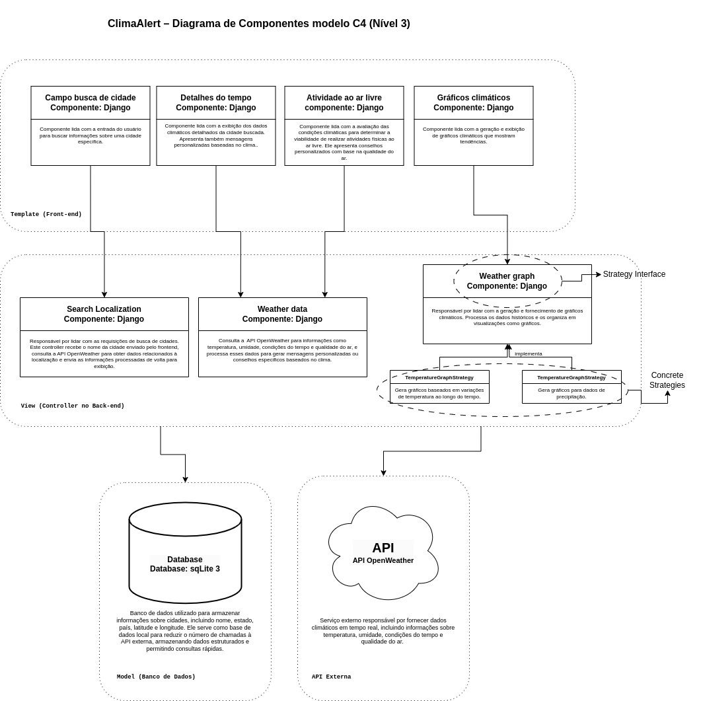

# Como Iniciar o servidor

## 1. Backend

```bash
cd backend/
export OPEN_WEATHER_API_KEY=<API_KEY>
export CLIMAALERT_APP_PORT=3333
npm install
npm run migrate
npm run dev
```

## 2. Frontend

```bash
cd frontend/react-app/
export REACT_APP_BACKEND=http://localhost:3333
npm install
npm start
```

# ClimaAlert

### AVISO: Entre as avaliações A4 e A5, nós reescrevemos toda o código em NodeJS, ao invés de Django por questões de performance e integração, a arquitetura abaixo da avaliação A4 é na versão de Django, o último commit feito em Django é [8dc80ff](https://github.com/viniguedes29/ClimaAlert/tree/8dc80ff22cbd21e025f5aa4101ccdaf942c8e4ea).

## Visão Geral

**ClimaAlert** é uma plataforma dedicada a fornecer informações em tempo real sobre o índice UV e alertas relacionados a riscos climáticos, como queimadas, deslizamentos e inundações. Utilizando mapas interativos e APIs climáticas, o objetivo é auxiliar os usuários na prevenção de riscos e na tomada de decisões seguras.

# Arquitetura da Aplicação ClimaAlert

## 1. Diagrama de Componentes (C4 - Nível 3)

A seguir, apresentamos o diagrama em nível de componentes para a arquitetura do sistema ClimaAlert:



---

## 2. Estilo Arquitetural

O estilo arquitetural adotado para o projeto é baseado no padrão **MVC (Model-View-Controller)**, adaptado ao framework Django, que utiliza o padrão **MTV (Model-Template-View)**. Essa abordagem organiza a aplicação em três camadas principais:

- **Model**: Gerencia os dados e a lógica de negócios.
- **Template (View)**: Apresenta as informações para o usuário e captura interações.
- **View (Controller)**: Processa as requisições, interage com os modelos e renderiza os templates.

Além disso, a aplicação segue o estilo arquitetural **Camadas** (Layered Architecture). Este estilo apresenta as seguintes características:

### Características do Estilo Arquitetural **Camadas**

1. **Divisão de Responsabilidades**:  
   Cada camada possui responsabilidades bem definidas, tornando o sistema mais modular e fácil de manter. Por exemplo:

   - A camada **Front-end (Template)** é responsável apenas pela interface e interação do usuário.
   - A camada **Back-end (Controllers)** processa requisições, aplica a lógica de negócio e atua como intermediária entre as outras camadas.
   - A camada **Model** lida com a persistência de dados no banco.

2. **Encapsulamento**:  
   As camadas ocultam sua implementação interna umas das outras. Por exemplo:

   - A camada de **Controllers** não precisa conhecer os detalhes de como os dados são armazenados no banco, apenas como interagir com o modelo.
   - O **Front-end** não conhece a lógica de processamento interna do sistema, apenas recebe os dados processados para exibição.

3. **Facilidade de Substituição**:  
   Componentes de uma camada podem ser substituídos ou atualizados sem impactar diretamente as demais camadas. Por exemplo:

   - É possível mudar a API externa utilizada (e.g., substituir OpenWeather por outra API) sem afetar diretamente a camada de apresentação.

4. **Separação de Preocupações**:  
   Cada camada é projetada para resolver um único conjunto de problemas relacionados ao sistema. Isso torna o código mais organizado e facilita futuras expansões ou modificações.

5. **Modularidade e Reuso**:  
   O estilo **Camadas** permite reusar componentes individuais em outros sistemas ou projetos. Por exemplo:
   - O modelo `City` pode ser reutilizado em um sistema que também lide com dados geográficos.
   - O componente de gráficos pode ser integrado em outro projeto que exija visualizações climáticas.

Esses aspectos tornam a aplicação mais robusta e preparada para lidar com mudanças ou adições de funcionalidades no futuro.

---

## 3. Principais Componentes e suas Responsabilidades

- **Front-end (Template)**:

  - **Campo busca de cidade**: Lida com a entrada do usuário para buscar informações sobre uma cidade específica.
  - **Detalhes do tempo**: Exibe informações climáticas detalhadas, como temperatura e umidade.
  - **Atividade ao ar livre**: Avalia condições climáticas para verificar a viabilidade de atividades físicas ao ar livre.
  - **Gráficos climáticos**: Apresenta gráficos que mostram tendências climáticas, como variações de temperatura ao longo do tempo.

- **Back-end (Controllers)**:

  - **SearchLocalization**: Gerencia as requisições de busca de cidades, interage com a API OpenWeather e o banco de dados.
  - **WeatherData**: Processa informações detalhadas do clima, como temperatura e condições atmosféricas, e fornece recomendações baseadas no clima.
  - **WeatherGraph**: Gera e organiza gráficos com base nos dados climáticos obtidos.

- **Banco de Dados (Model)**:

  - Utiliza o banco **SQLite3** para armazenar informações estruturadas, como detalhes das cidades (nome, estado, país, latitude, longitude).

- **API Externa**:
  - Integra com a **OpenWeather API** para obter dados climáticos atualizados, como temperatura, condições atmosféricas e qualidade do ar.

---

## 4. Padrão de Projeto

Para o componente **WeatherGraph (Controller)**, foi adotado o padrão de projeto **Strategy**, que permite a criação de diferentes estratégias para gerar gráficos climáticos (e.g., gráficos de temperatura, precipitação, ou umidade) sem modificar o código do controller principal.

### WeatherGraph

O componente `WeatherGraph` utiliza o padrão de projeto **Strategy** para delegar a geração de gráficos climáticos a diferentes estratégias especializadas. Isto é, o WeatherGraph não contém a lógica específica para a geração de gráficos, ele delega a responsabilidade para uma das estratégias (e.g., TemperatureGraphStrategy) com base no tipo de gráfico solicitado. Atualmente, as estratégias implementadas incluem:

- **TemperatureGraphStrategy**: Gera gráficos baseados em previsões da média de temperatura ao 5 dias.
- **PrecipitationGraphStrategy**: Gera gráficos para dados de precipitação em mm.

Essa abordagem permite que novos tipos de gráficos sejam adicionados facilmente, sem modificar o código existente do controller, seguindo o princípio de **Open/Closed** (aberto para extensão, fechado para modificação).

---

## Start server

```
OPEN_WEATHER_API_KEY="<API_KEY>" python3 manage.py runserver
```
