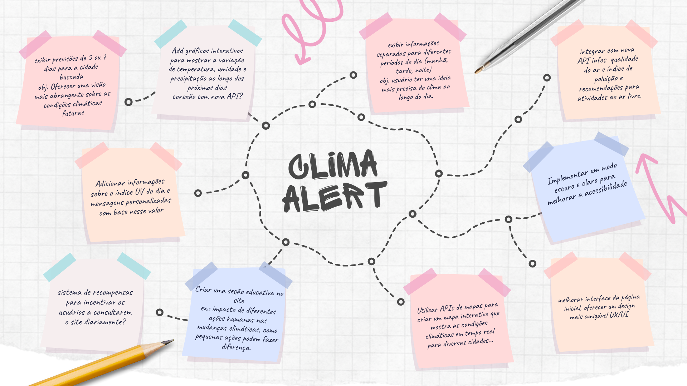
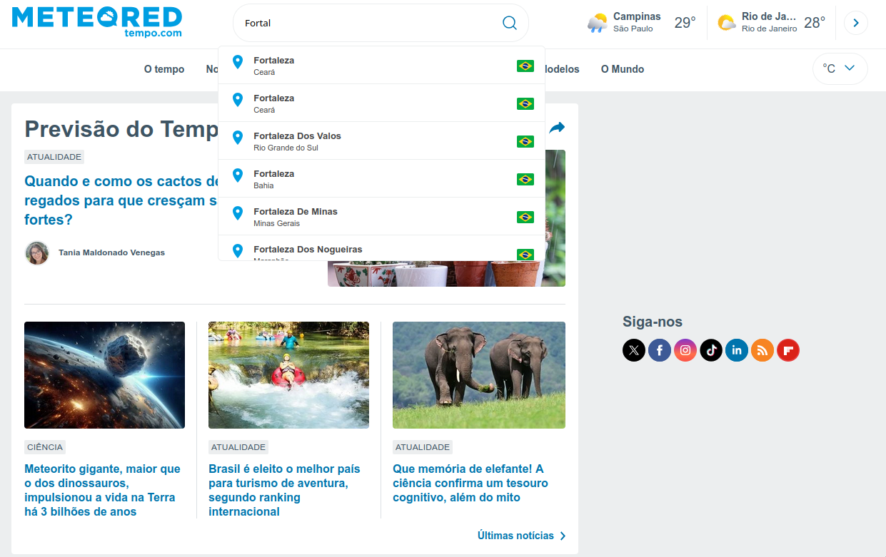
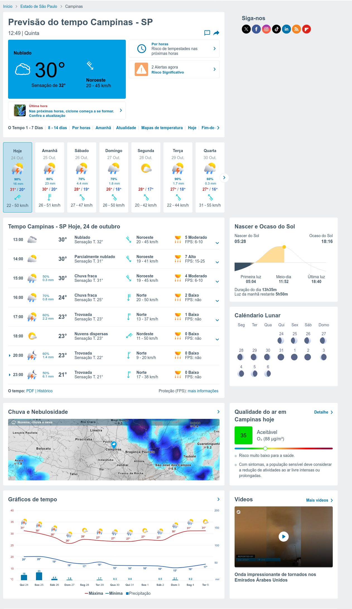
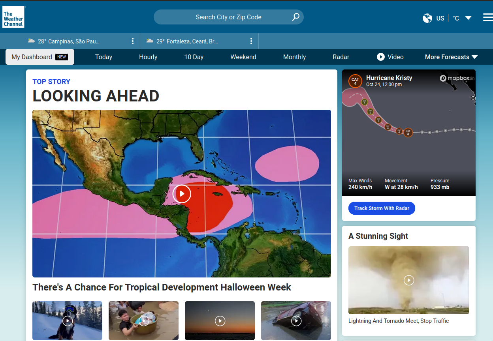
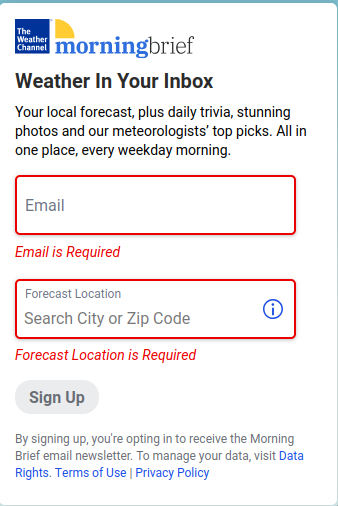
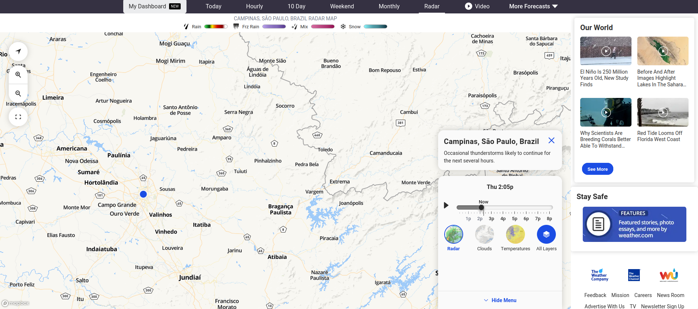
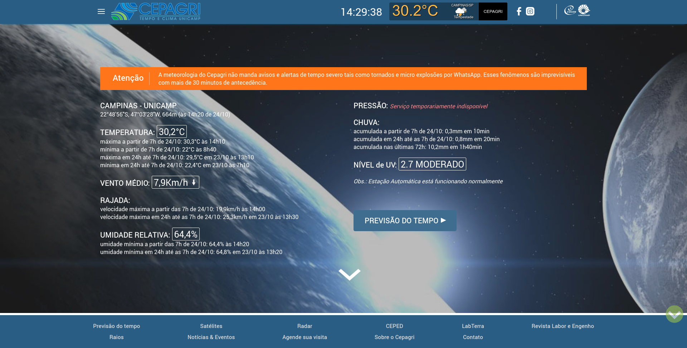
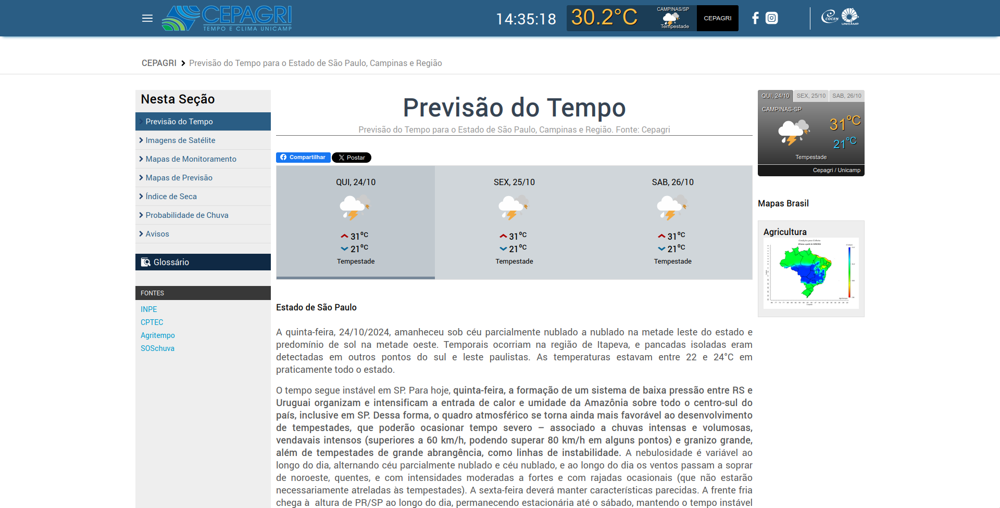

## A3 - Técnicas de elicitação de requisitos utilizadas

### 1. Brainstorming
Para explorar novas funcionalidades e melhorias para a plataforma **Clima Alert**, realizamos uma sessão de brainstorming on-line pelo meet com todos os membros do grupo. Nessa sessão, discutimos e registramos ideias que poderiam ser implementadas, focando em aspectos como interface, novas integrações e demais funcionalidades úteis para os usuários. A imagem do brainstorming, mostrando as ideias discutidas e mapeadas durante a sessão, está anexada abaixo como evidência.

**Evidências:**
- 
- 

### 2. Benchmark

Escolhemos como segunda atividade de elicitação a atividade de *benchmarking*. Para isso, nosso grupo escolheu fazer a análise de 3 sites: [weather.com](https://weather.com), [tempo.com](https://www.tempo.com) e o [CEPAGRI](https://www.cpa.unicamp.br/) da própria UNICAMP.

#### [Meteored (tempo.com)](https://www.tempo.com)

Nesse site, analisaremos as seguintes funcionalidades: Busca de uma cidade por nome, análise do clima da cidade e o uso do mapa interativo.

#### Documentação de Features e Funcionalidades

##### Busca de cidade

Ná pagina inicial, a barra de busca fica de maneira intuitiva no topo da página, facilitando o uso do site por usuários que apenas desejam observar o clima. Além disso, o clima da cidade atual é exibido no canto superior direito, e caso você abra o site em outro local mas no mesmo navegador, as cidades que você visitou ficam salvas localmente, permitindo facilidade na hora de visualizar o clima delas.

A barra de busca é dinamica, os resultados vão aparecendo aparecendo a medida que o usuário vai digitando, sendo exibidos indicadores como bandeira do país, e o estado da cidade para evitar a seleção de cidades erradas. Em alguns casos os resultados são exibidos de forma duplicada, não conseguimos encontrar a razão disso, mas provavelmente são dois dados diferentes que não foram unificados.

#### Ánalise do clima

A informação da temperatura é exibida de forma destacada no site, mostrando de forma clara o clima atual e a previsão dos próximos 7 dias, alertas também são visíveis, mas não de forma tão clara. A linha que contém as opções de exibição, como **O Tempo 1 - 7 Dias** possuí inconsistências, já que todas as informações estão condensadas na mesma linha. Por exemplo, para informações do satélite é necessário scrollar até o final da linha, sendo que não existe indicativos de que essa linha contenha essa informação.

Abaixo na página podemos ver as informações da qualidade do ar e informações que normalmente não são atrativas para todos os usuários do site.

#### Mapa Interativo

O mapa interativo é bem intuitivo, permite a pesquisa por cidade e exibição das informações da cidade escolhida, além de animações como mapas de calor e chuva, e direção do vento, sendo ainda possível escolher diretamente no mapa o dia que o usuário deseja olhar o clima.

O mapa não possuí boas ferramentas de acessibilidade (ou pelo menos não de forma intuitiva), é necessário o uso do mouse para navegar entre as cidades, e nas tentativas de navegação com o TAB acabamos conseguindo fechar o mapa algumas vezes, sendo necessário a reinicialização da página.

#### Acessibilidade

A barra de busca é facilmente acessível através apenas do uso do teclado, mas o uso excessivo de tags div's a divigultam a navegação

O site não possuí ferramentas de acessibilide nativas, e o HTML nem sempre é bem estruturado, dificultando o uso através do teclado, mas pro uso geral é intuitivo apenas com o uso do teclado e um leitor conseguir acessar as informações do clima de uma cidade. O mapa interativo não possuí (ou pelo menos não de forma intuitiva) uma maneira de ser utilizado sem o mouse, nas tentivas de navegação com o TAB acabamos conseguindo fechar o mapa algumas vezes, sendo necessário reiniciar a página.

### Pontos positivos e negativos

#### Pontos Positivos:
   - A busca de cidade é dinâmica e intuitiva.
   - Cidades visitadas anteriormente são salvas localmente no navegador.
   - Informações da temperatura são exibidas de forma clara e destacada.
   - O mapa interativo é intuitivo e oferece animações de mapas de calor, chuva e direção do vento.

#### Pontos Negativos:
   - Resultados da busca podem aparecer duplicados.
   - Linha com opções de exibição possui inconsistências, com informações condensadas e sem indicação clara.
   - O mapa interativo não é totalmente acessível sem o uso do mouse, apresentando problemas de navegação ao tentar usar o teclado.

#### [The Weather Channel (weather.com)](https://weather.com)

O site é extremamente similante ao site anterior, então analisaremos apenas alguns diferencias entre os dois sites.

#### Documentação de Features e Funcionalidades

##### Busca de cidade

Assim como no site anterior, a barra de busca é fornecida de forma intuitiva pro usuário, além de ser fácil a mudança de idioma do site e de Celsius para Fahrenheit. A barra, embora dinâmica, é mais lenta para atualizar as informações do que no outro site, e permite que o usuário selecione uma cidade inexistente, fazendo apenas com que a página atual reinicie. Mas um diferencial é que ela permite pesquisa por Postal Code, embora pareça não suportar o CEP brasileiro.

#### Newsletter

Uma feature interessante é a possibilidade de se registar na Newsletter do site, recebendo informações sobre o clima e algumas curiosidades/fotos. Para utilizar, basta se cadastrar na página principal do site, também de forma bem intuitiva.

#### Mapa interativo

O mapa interativo do website possuí diversas melhorias em relação ao mapa anterior, sendo bem mais limpo e rápido, além das funções de acessibilidade serem superiores, como a navegação através do teclado.

### Pontos Positivos:

- Oferece pesquisa por Postal Code, adicionando flexibilidade a pesquisa.
- Disponibiliza uma newsletter com informações climáticas e curiosidades.
- O mapa interativo é mais rápido, limpo e tem ótimas ferramentas de acessibilidade.

### Pontos Negativos:

- A barra de busca é lenta para atualizar as informações.
- Permite a seleção de uma cidade inexistente, reiniciando a página sem uma mensagem de erro clara.
- Não parece suportar o CEP brasileiro na pesquisa por Postal Code.

#### [CEPAGRI](www.cpa.unicamp.br/)

Esse site, diferente dos outros, tem o foco exclusivo na região de Campinas, mas ainda sim podemos analisar algumas funções interessantes de serem replicadas.

#### Documentação de Features e Funcionalidades

##### Página inicial

A páginal inicial já mostra várias informações sobre a cidade de Campinas, como nível de UV, temperatura e vento. Como o site não tem o objetivo de mostrar notícias ao usuário, a maior parte das informações relevantes já pode ser colocada na página principal.

##### Previsão do tempo

A sessão de previsão do tempo é extremamente detalhada, algo que novamente só é possível pois as informações são apenas de Campinas. A página é organizada de forma útil para o usuário, mostrando as informações relevantes inicialmente e vai aprofundando a medida que descemos nela. O usuário também pode consultar as fontes utilizadas na aba lateral. A página também possuí um glossário, mas que não parecia funcionar no momento da análise da página.

### Pontos Positivos:

- A página inicial é focada e mostra várias informações relevantes, como nível de UV, temperatura e vento.
- A previsão do tempo é extremamente detalhada e organizada de forma útil, com as informações mais relevantes no topo.
- Possui uma seção de fontes para consulta, permitindo transparência nos dados exibidos.

### Pontos Negativos:

- O glossário não parecia estar funcionando no momento da análise.
- O foco exclusivo em Campinas limita a aplicação para usuários fora dessa região.

#### Requisitos

A partir das informações acima, temos alguns requisitos que podemos extrair da análise:
   - Localização Automática
   - Salvar as cidades mais recentes na página principal
   - Garantir que todas as funções do site possuam bons níveis de acessibilidade
   - Garantir que o mapa interativo seja usável através do teclado
   - Newsletter de mudanças no clima local
   - Notificação por WhatsApp/Telegram de mudanças no clima
   - Garantir desempenho na pesquisa de cidades, aumentando a fluidez do aplicativo
   - Permitir busca por CEP e variações
