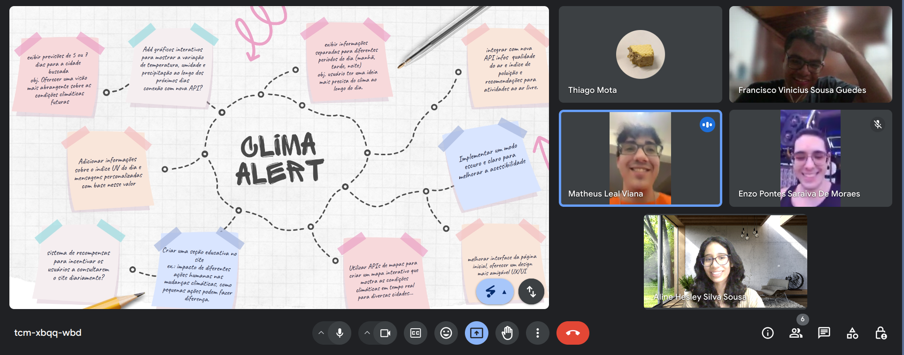

## A3 - Técnicas de elicitação de requisitos utilizadas

### 1. Brainstorming
Para explorar novas funcionalidades e melhorias para a plataforma **Clima Alert**, realizamos uma sessão de brainstorming on-line pelo meet com todos os membros do grupo. Nessa sessão, discutimos e registramos ideias que poderiam ser implementadas, focando em aspectos como interface, novas integrações e demais funcionalidades úteis para os usuários. A imagem do brainstorming, mostrando as ideias discutidas e mapeadas durante a sessão, está anexada abaixo como evidência.

**Evidências:**
- 
- 

### 2. Entrevista
Também realizamos uma entrevista com perguntas estruturadas para entender as necessidades e preferências dos usuários em relação à plataforma. As perguntas foram formuladas para coletar insights sobre as informações climáticas mais relevantes, formatos de apresentação, tipos de notificações e personalização que os usuários desejam.

Antes de iniciar a entrevista, explicamos aos participantes que a atividade faz parte de uma disciplina de Engenharia de Software, fornecendo um breve overview do que já foi desenvolvido até o momento e qual é a proposta inicial da plataforma. Também apresentamos o estado atual do projeto, incluindo funcionalidades já implementadas e o layout atual, para que os entrevistados pudessem contextualizar suas respostas e fornecer feedback mais preciso e relevante.

**Perguntas da Entrevista:**
1. Quais informações climáticas você considera mais importantes e gostaria de ver ao buscar o clima de uma cidade?
   - *(Ex.: temperatura, umidade, índice UV, qualidade do ar, previsão para os próximos dias, etc.)*
2. Qual formato de apresentação das informações você acha mais útil?
   - *(Ex.: gráficos, tabelas, mapas interativos, mensagens curtas e diretas, etc.)*
3. Quais tipos de notificações ou alertas climáticos seriam mais relevantes para você?
   - *(Ex.: alertas de tempestade, ondas de calor, índice de qualidade do ar, etc.)*
4. Se pudesse personalizar a plataforma, quais funcionalidades ou ajustes visuais seriam importantes para você?
   - *(Ex.: modo escuro, tradução automática, layout simplificado, etc.)*
5. Existe alguma outra funcionalidade que você acha que poderia ser útil para tornar a experiência mais completa ou interativa?

**Evidência:**
- (Espaço reservado para anexar o áudio/vídeo da entrevista)

## Conclusão
Para registrar as evidências das técnicas de elicitação de requisitos utilizadas, anexamos as imagens e registros das sessões realizadas, incluindo o brainstorming e a entrevista.
